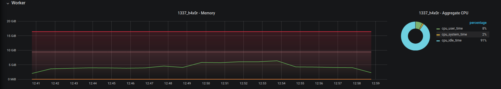
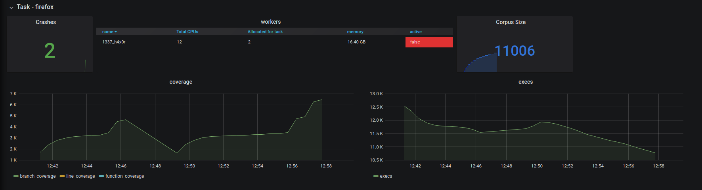
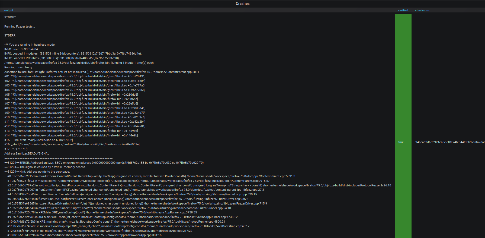

# Fuzzy

## Introduction

Fuzzy is intended to manage fuzzing things easier. It does this by building orchestrations around general tasks of
fuzzing like corpus collection, crash collection, crash verification etc.

- [Setup](setup/playbooks/README.md)
- [Usage](docs/USAGE.md)
- [Usecase Examples](docs/USECASES.md)

## Dashboards

A grafana dashboard is available on master at `3000`.

