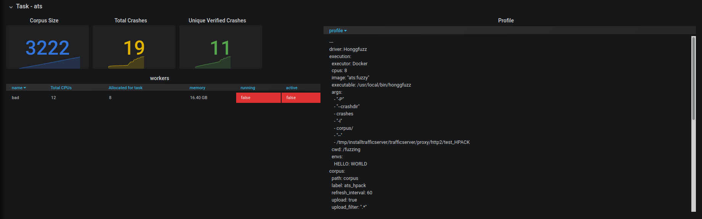

# Fuzzy

## Introduction

Fuzzy is intended to manage fuzzing things easier. It does this by building orchestrations around general tasks of
fuzzing like corpus collection, crash collection, crash verification etc.

## Setup

Please go through [Setup](setup/playbooks/README.md).

## Usage

Please go through [Usage](docs/USAGE.md).

## Dashboards

A grafana dashboard is available on master at `3000`.

